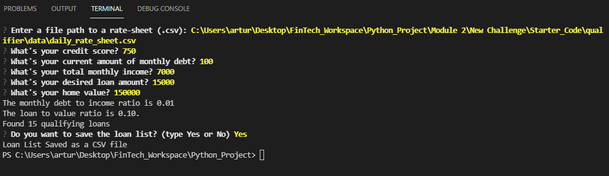

# Loan Qualifier

This project consists of a questioner used to match the user’s financial information to a potential loan offered by a bank. Once the user’s information is analyzed, a bank loan list is created. The code allows the user to save the list of loans as a CSV file.

---

## Technologies

Describe the technologies required to use your project such as programming languages, libraries, frameworks, and operating systems. Be sure to include the specific versions of any critical dependencies that you have used in the stable version of your project.

Project was developed using the following technologies, programming languages, libraries

Visual Studio

Language: Python

Libraries:
import sys
import fire
import questionary
import csv
from pathlib import Path

No special versions of any critical dependencies
---

## Installation Guide

No special instructions to install libaries. 

---

## Examples

The following is an example of thow the program works.

1.- Once the program runs, a field in the termina will display with the following 
" Enter a file path to a rate-sheet (.csv):"
2.- The path to the daily_rate_sheet.csv file has to be placed on the field provided by the terminal.
3.-Then, the terminal will ask 5 questions. One question at a time. The user must answer the questions 
    using numbers and hit the Enter Key
    "What's your credit score?"
    "What's your current amount of monthly debt?"
    "What's your total monthly income?"
    "What's your desired loan amount?"
    "What's your home value?"
4.- The terminal will then display the monthly debt to income ratio, the loan to value ratio and 
    the numer of loans that match the financial information of the user.
5.- The terminal then asks the user if he/she wants to save the list of loans to be saved as a CSV file by selecting Yes or No. 
6.- Once the user makes a selection, the terminal will confirm if the list was saved as a CSV or if it was not saved.
7.- This ends the program.

---

## Usage

---

## Contributors

Arturo Garcidueñas

---

## License

None. This is a program created for a school project.
